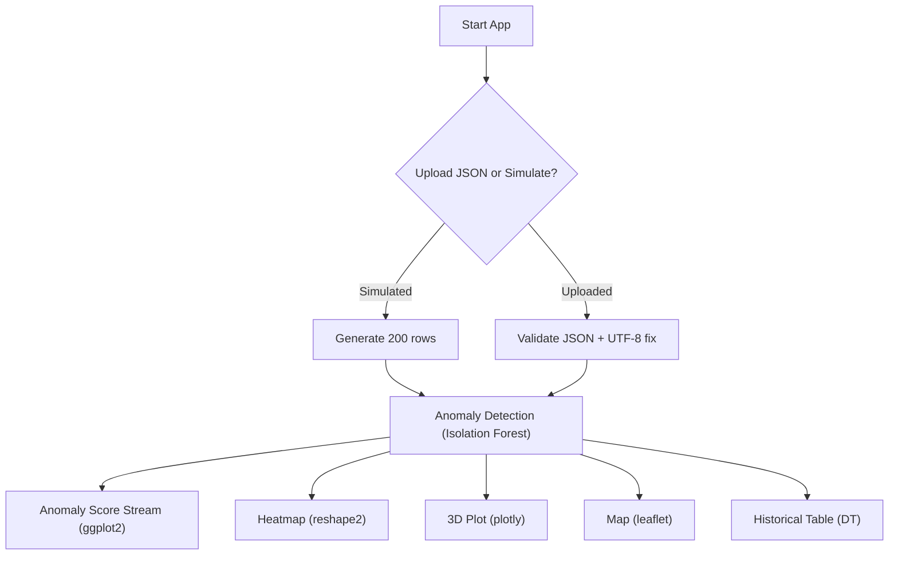

# 📊 Earthquake Anomaly Detection System

> Built with R + Shiny | JSON-Based Sensor Simulation | AI-Powered Anomaly Detection

---

## 🔍 [Overview](#overview)

This Shiny application simulates a real-time earthquake monitoring system that:

* Ingests JSON-based sensor data
* Uses Isolation Forests to detect anomalies
* Visualizes anomalies using 2D/3D plots and maps
* Features a modern, interactive dashboard (now using **Leaflet** instead of `echarts4r`)

This project was rebuilt and debugged with classmate **Myles Merriweather** in mind to show the evolution from early bugs to a stable, production-ready app.

---

## 🛠️ [What Was Improved](#what-was-improved)

### ✅ Switched to JSON instead of .CSV

* JSON allowed structured, hierarchical data simulation via PowerShell.
* CSV was causing parsing errors and lacked the flexibility needed for nested simulation.

### ✅ Map Tab Refactored

* **echarts4r** map was unstable and produced `must pass serie` errors.
* Switched to **Leaflet** for precise latitude/longitude plotting with color-coded risk levels and tooltips.

### ✅ UTF-8 Fix

* JSON files created in Windows often include a Byte Order Mark (BOM) which crashes RStudio's `fromJSON()`.
* Added a line to strip the BOM for consistent UTF-8 parsing.

### ✅ Core Logic Debugged

* Missing tildes, bad symbol bindings, missing columns — all repaired.
* Errors handled gracefully with `tryCatch()` and `validate(need(...))`.

---

## ⚙️ [Tech Stack](#tech-stack)

### 📦 Packages

<div align="center">
  
  
  
  
  
  
  
  
  
  
</div>

---

## 💾 [Simulated JSON via PowerShell](#simulated-json-via-powershell)

```powershell
# PowerShell script to simulate 200 rows of earthquake data and save as JSON
$data = @()
1..200 | ForEach-Object {
  $base = Get-Random -Minimum 0.3 -Maximum 0.7
  $row = [PSCustomObject]@{
    Timestamp = (Get-Date).AddMinutes(-($_ * 10)).ToString("yyyy-MM-dd HH:mm:ss")
    Sensor1   = [math]::Round($base + (Get-Random -Minimum -0.05 -Maximum 0.05), 2)
    Sensor2   = [math]::Round($base + (Get-Random -Minimum -0.04 -Maximum 0.04), 2)
    Sensor3   = if ($_ % 40 -eq 0) { Get-Random -Minimum 2.5 -Maximum 4.0 } else { [math]::Round($base + (Get-Random -Minimum -0.06 -Maximum 0.06), 2) }
    Sensor4   = if ($_ % 40 -eq 0) { Get-Random -Minimum 2.5 -Maximum 4.0 } else { [math]::Round($base + (Get-Random -Minimum -0.06 -Maximum 0.06), 2) }
    Sensor5   = [math]::Round($base + (Get-Random -Minimum -0.05 -Maximum 0.05), 2)
    Magnitude = if ($_ % 40 -eq 0) { Get-Random -Minimum 4.0 -Maximum 7.0 } else { Get-Random -Minimum 0.5 -Maximum 2.0 }
    Latitude  = Get-Random -Minimum 55.0 -Maximum 65.0
    Longitude = Get-Random -Minimum 10.0 -Maximum 20.0
  }
  $data += $row
}
$data | ConvertTo-Json -Depth 3 | Out-File -Encoding UTF8 earthquake_data.json
```

---

## 🧠 [Why I Chose R Over Python](#why-i-chose-r-over-python)

* R has native support for statistical models like Isolation Forest via `{isotree}`.
* `{shiny}` provides a GUI framework that feels more like PowerBI or Tableau.
* Easier integration with reactive plots, dynamic filtering, and tabbed dashboards.

---

## 📋 [Final `app.R`](#final-app-r)

<details>
<summary>Click to expand</summary>

```r
library(shiny)
library(dplyr)
library(jsonlite)
library(shinyjs)
library(ggplot2)
library(isotree)
library(leaflet)
library(plotly)
library(DT)
library(lubridate)
library(reshape2)

simulate_api_data <- function(n_rows = 200) {
  set.seed(42)
  timestamps <- Sys.time() - seq(0, by = 600, length.out = n_rows)
  base_noise <- rnorm(n_rows, mean = 0.5, sd = 0.2)
  spike_indices <- seq_len(n_rows) %% 40 == 0
  tibble(
    Timestamp = timestamps,
    Sensor1 = pmax(0, pmin(1, base_noise + rnorm(n_rows, 0, 0.1))),
    Sensor2 = pmax(0, pmin(1, base_noise + rnorm(n_rows, 0, 0.1) * 0.8)),
    Sensor3 = ifelse(spike_indices, runif(n_rows, 2.5, 4.0), pmax(0, base_noise + rnorm(n_rows, 0, 0.15))),
    Sensor4 = ifelse(spike_indices, runif(n_rows, 2.5, 4.0), pmax(0, base_noise + rnorm(n_rows, 0, 0.15))),
    Sensor5 = pmax(0, pmin(1, base_noise + rnorm(n_rows, 0, 0.1))),
    Magnitude = ifelse(spike_indices, runif(n_rows, 4.0, 7.0), runif(n_rows, 0.5, 2.0)),
    Latitude = runif(n_rows, 55, 65),
    Longitude = runif(n_rows, 10, 20)
  )
}

ui <- fluidPage(
  useShinyjs(),
  titlePanel("Earthquake Warning System"),
  sidebarLayout(
    sidebarPanel(
      sliderInput("threshold", "Anomaly Score Threshold", min = 0, max = 1, value = 0.85, step = 0.01),
      fileInput("uploadData", "Upload Sensor Data (.json)", accept = ".json")
    ),
    mainPanel(
      tabsetPanel(
        tabPanel("Anomaly Score Stream", plotOutput("ggplotPlot")),
        tabPanel("Sensor Heatmap", plotOutput("heatmapPlot")),
        tabPanel("3D Sensor Correlation", plotlyOutput("plotly3D")),
        tabPanel("Earthquake Map", leafletOutput("mapPlot")),
        tabPanel("Historical Data", DTOutput("dataTable"))
      )
    )
  )
)

server <- function(input, output, session) {
  uploaded_data <- reactive({
    req(input$uploadData)
    file <- input$uploadData
    raw_json <- readLines(file$datapath, warn = FALSE)
    raw_json[1] <- sub("^\uFEFF", "", raw_json[1])
    data <- fromJSON(paste(raw_json, collapse = ""), simplifyDataFrame = TRUE) %>% as_tibble()
    data
  })
  
  data <- reactive({
    if (!is.null(input$uploadData)) uploaded_data() else simulate_api_data(50)
  })
  
  model_data <- reactiveVal()
  observe({
    df <- req(data())
    if (nrow(df) < 2) df <- bind_rows(df, simulate_api_data(2))
    x <- scale(df[, c("Sensor1", "Sensor2", "Sensor3", "Sensor4", "Sensor5")])
    x[is.na(x)] <- 0
    model <- isolation.forest(x, ntrees = 100, seed = 42)
    scores <- predict(model, x, type = "score")
    df$AnomalyScore <- scores
    df$Severity <- case_when(
      scores > input$threshold + 0.1 ~ "High",
      scores > input$threshold ~ "Medium",
      TRUE ~ "Low"
    )
    model_data(df)
  })
  
  filtered_data <- reactive({
    req(model_data())
  })
  
  output$ggplotPlot <- renderPlot({
    df <- tryCatch(req(filtered_data()), error = function(e) NULL)
    if (is.null(df) || !is.data.frame(df) || nrow(df) < 2) {
      validate(need(FALSE, "Anomaly Score plot requires at least 2 valid rows of data."))
    }
    ggplot(df, aes(seq_along(AnomalyScore), AnomalyScore)) +
      geom_point(color = "#FFA500", size = 4) +
      geom_line(color = "#FFA500", linewidth = 1.5) +
      geom_hline(yintercept = input$threshold, color = "#FF2400", linetype = "dashed", linewidth = 1.5) +
      labs(title = "Anomaly Score Stream", x = "Index", y = "Score") +
      theme_minimal()
  })
  
  output$heatmapPlot <- renderPlot({
    df <- tryCatch(req(filtered_data()), error = function(e) NULL)
    if (is.null(df) || !is.data.frame(df) || nrow(df) < 2) {
      validate(need(FALSE, "Heatmap requires at least 2 valid rows of data."))
    }
    sensor_data <- df %>% select(starts_with("Sensor"))
    sensor_data <- sensor_data[, apply(sensor_data, 2, sd, na.rm = TRUE) != 0]
    if (ncol(sensor_data) < 2) {
      validate(need(FALSE, "Not enough varied sensor data to generate a heatmap."))
    }
    cor_matrix <- cor(sensor_data, use = "complete.obs")
    melted_cor <- melt(cor_matrix)
    ggplot(melted_cor, aes(Var1, Var2, fill = value)) +
      geom_tile() +
      scale_fill_gradientn(colors = c("#000000", "#FFA500", "#FF2400")) +
      labs(title = "Sensor Correlation Heatmap") +
      theme_minimal()
  })
  
  output$plotly3D <- renderPlotly({
    df <- tryCatch(req(filtered_data()), error = function(e) NULL)
    if (is.null(df) || !is.data.frame(df) || nrow(df) < 2) {
      validate(need(FALSE, "3D Sensor plot requires at least 2 valid rows of data."))
    }
    plot_ly(
      data = df,
      x = ~Sensor1,
      y = ~Sensor2,
      z = ~Sensor3,
      color = ~AnomalyScore,
      size = ~Magnitude,
      type = "scatter3d",
      mode = "markers"
    )
  })
  
  output$mapPlot <- renderLeaflet({
    df <- tryCatch(req(filtered_data()), error = function(e) NULL)
    if (is.null(df) || !is.data.frame(df) || nrow(df) < 2) {
      validate(need(FALSE, "Map requires at least 2 valid rows of data."))
    }
    
    leaflet(df) %>%
      addProviderTiles(providers$CartoDB.Positron) %>%
      addCircleMarkers(
        lng = ~Longitude,
        lat = ~Latitude,
        radius = ~Magnitude * 2,
        color = ~ifelse(Severity == "High", "#FF2400", ifelse(Severity == "Medium", "#FFA500", "#2E8B57")),
        stroke = FALSE,
        fillOpacity = 0.8,
        popup = ~paste0("<b>Magnitude:</b> ", round(Magnitude, 2),
                        "<br><b>Score:</b> ", round(AnomalyScore, 3),
                        "<br><b>Severity:</b> ", Severity)
      )
  })
  
  output$dataTable <- renderDT({
    df <- req(filtered_data())
    datatable(df, options = list(pageLength = 10))
  })
}

shinyApp(ui, server)

```

</details>

---

## 🗺️ [Mermaid Workflow](#mermaid-workflow)



---

## 💡 [Suggestions to Improve the App Further](#suggestions-to-improve-the-app-further)

* Add real-time polling using `invalidateLater()`
* Connect to USGS live API for real earthquake feed
* Replace leaflet popups with modal windows
* Add download button for filtered data
* Add dark/light theme toggle using `bslib`
* Create an R package out of this for reuse

---

## 🧾 [Conclusion](#conclusion)

If you’re new to software or data development:

* This project showcases how R can build fully interactive dashboards
* Even without front-end experience, Shiny helps data analysts prototype apps fast
* The switch from CSV to JSON, using AI models, debugging R errors — these are common but solvable problems

> The biggest takeaway? **Debugging is learning.** Every crash helped harden this app into something shareable.

Let me know what you think, Myles!

---

